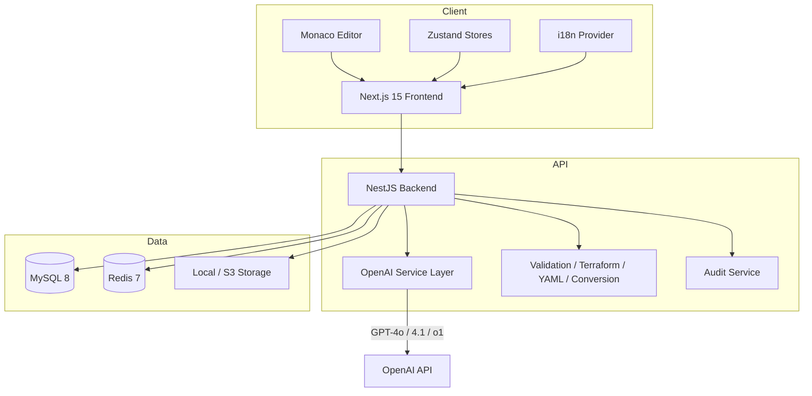
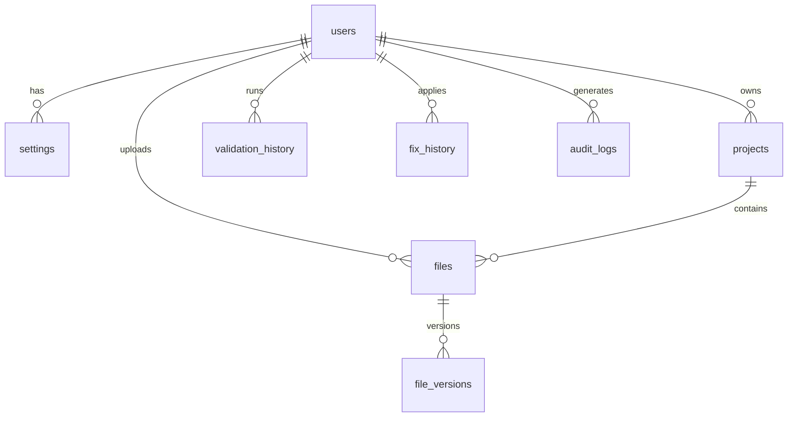
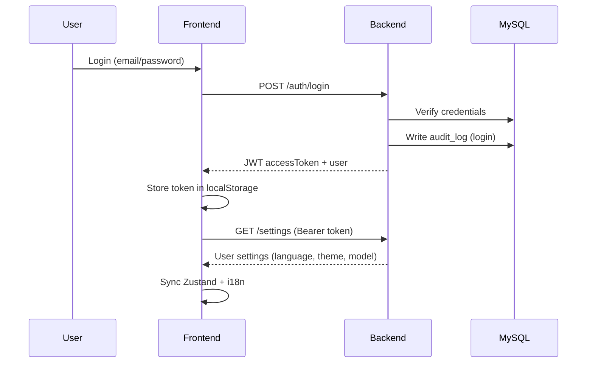
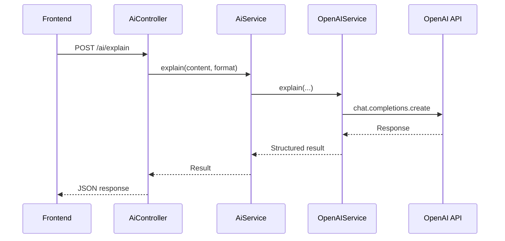
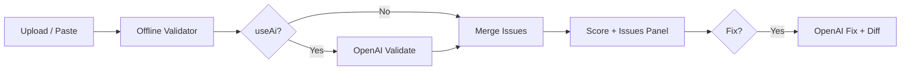
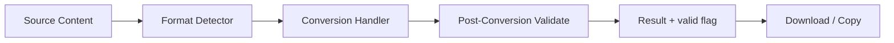
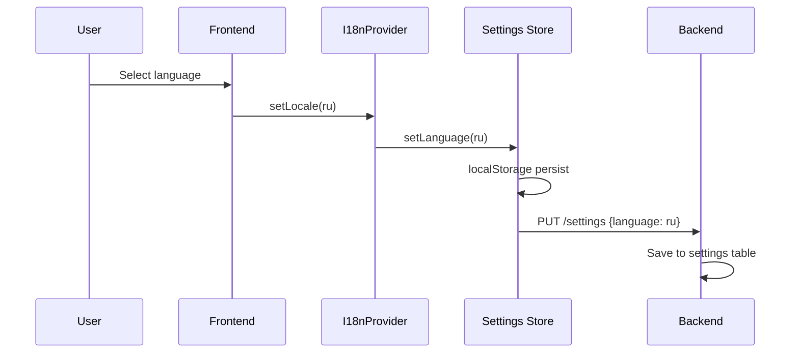
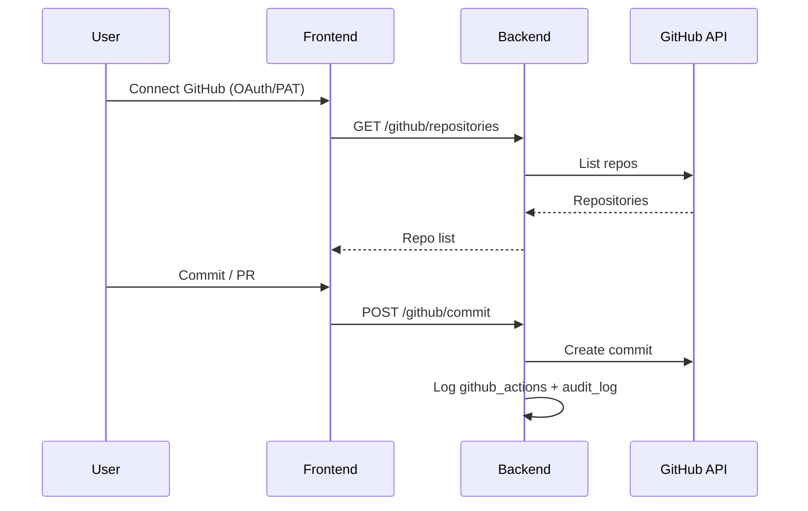

# IaC Platform — Enterprise AI-Powered YAML & Terraform Validation

Enterprise-grade Infrastructure-as-Code validation, analysis, conversion, and management platform powered exclusively by **OpenAI**.

| Service | URL |
|---------|-----|
| Frontend | http://localhost:3000 |
| Backend API | http://localhost:4000/api/v1 |
| Swagger Docs | http://localhost:4000/docs |
| MySQL | localhost:3307 |
| Redis | localhost:6379 |

---

## Overview

IaC Platform is a full-stack monorepo that helps teams validate, fix, explain, optimize, and convert YAML, Terraform, JSON, XML, Kubernetes manifests, Docker Compose, and 20+ IaC formats. All AI capabilities route through a single centralized OpenAI service layer.

**Supported languages:** English (en), Russian (ru), Armenian (hy)

---

## Features

| Category | Capabilities |
|----------|-------------|
| **Editor** | Monaco editor, multi-tab, upload/download, diff viewer, hover intelligence |
| **Validation** | Offline syntax + AI validation, line/column errors, scoring |
| **AI (OpenAI)** | Chat, validate, fix, explain, optimize, security audit, translate, cost analysis, docs generation |
| **Terraform** | Validate, format, dependency graph, module analysis, cost estimate, plan review |
| **YAML** | Schema validation (K8s, OpenAPI, Docker Compose, Helm, GitHub Actions) |
| **Conversion** | YAML↔JSON↔XML↔TOML↔INI↔Terraform↔CSV with post-validation |
| **Compliance** | CIS/NIST/SOC2/ISO27001 scanning, risk scores |
| **GitHub** | Repositories, commits, branches, commits, PRs |
| **Analytics** | Validations, fixes, uploads, AI requests, activity charts |
| **History** | Validation, fix, translation, upload, GitHub, AI request audit trail |
| **Workspace** | Multi-project file organization |
| **i18n** | Full UI translation (en/ru/hy), browser detection, localStorage + DB persistence |

---

## Architecture



### Tech Stack

| Layer | Technology |
|-------|-----------|
| Frontend | Next.js 15, React 19, TypeScript, TailwindCSS, ShadCN UI, Framer Motion, Monaco Editor, Zustand |
| Backend | NestJS 11, TypeScript, TypeORM |
| Database | MySQL 8.0 |
| Cache | Redis 7 |
| AI | **OpenAI only** — centralized at `apps/backend/src/services/openai/` |
| Auth | JWT + OAuth hooks (Google, GitHub) |
| Deploy | Docker Compose, Kubernetes, GitHub Actions |

---

## Folder Structure

```
YAML--Terraform/
├── apps/
│   ├── backend/                    # NestJS API
│   │   └── src/
│   │       ├── services/openai/    # Centralized OpenAI layer
│   │       ├── modules/            # Feature modules
│   │       ├── entities/           # TypeORM entities
│   │       └── database/migrations/
│   └── frontend/                   # Next.js 15 app
│       └── src/
│           ├── app/                # Pages (App Router)
│           ├── components/         # UI components
│           ├── locales/            # en.json, ru.json, hy.json
│           ├── i18n/               # I18nProvider
│           └── stores/             # Zustand state
├── packages/shared/                # Shared types & utilities
├── docker/                         # Dockerfiles
├── k8s/                            # Kubernetes manifests
├── docs/                           # Architecture & audit docs
└── docker-compose.yml
```

---

## Database Design

Schema: `apps/backend/src/database/migrations/init.sql`

| Table | Purpose |
|-------|---------|
| `users` | User accounts (local + OAuth) |
| `settings` | Per-user preferences (theme, language, AI model) |
| `projects` | Workspace projects |
| `files` | Uploaded/managed files |
| `file_versions` | Version history per file |
| `validation_history` | Validation runs with issues JSON |
| `fix_history` | Fix operations with before/after diff |
| `translations` | AI translation records |
| `github_actions` | GitHub commit/push/PR history |
| `audit_logs` | Enterprise audit trail (login, validation, fix, etc.) |
| `api_usage` | AI request tracking |
| `chat_history` | AI chat sessions |
| `backups` | File backup snapshots |
| `team_members` | Team collaboration (schema ready) |
| `comments` | File comments (schema ready) |



---

## API Design

Base URL: `/api/v1`

### Authentication (`/auth`)

| Method | Endpoint | Auth | Description |
|--------|----------|------|-------------|
| POST | `/auth/register` | No | Create account |
| POST | `/auth/login` | No | JWT login |
| POST | `/auth/refresh` | No | Refresh token |
| GET | `/auth/me` | Yes | Current user |

### Validation (`/validation`)

| Method | Endpoint | Description |
|--------|----------|-------------|
| POST | `/validation` | Validate content (offline + optional AI) |
| POST | `/validation/fix` | Auto-fix with diff |

### AI — OpenAI (`/ai`)

| Method | Endpoint | Description |
|--------|----------|-------------|
| GET | `/ai/status` | OpenAI connectivity status |
| POST | `/ai/validate` | AI validation |
| POST | `/ai/fix` | AI fix |
| POST | `/ai/explain` | AI explanation |
| POST | `/ai/optimize` | Optimization suggestions |
| POST | `/ai/security-audit` | Security analysis |
| POST | `/ai/hover-explain` | Line hover intelligence |
| POST | `/ai/translate` | Content translation |
| POST | `/ai/generate` | Content generation |
| POST | `/ai/root-cause` | Root cause analysis |
| POST | `/ai/cost-analysis` | Cost analysis |
| POST | `/ai/generate-docs` | Documentation generation |

### Terraform (`/terraform`)

| Method | Endpoint | Description |
|--------|----------|-------------|
| POST | `/terraform/validate` | Structure + syntax validation |
| POST | `/terraform/format` | HCL formatting |
| POST | `/terraform/dependency-graph` | Resource dependency graph |
| POST | `/terraform/modules` | Module analysis |
| POST | `/terraform/cost-estimate` | Cost estimation |
| POST | `/terraform/plan-review` | AI plan review |
| POST | `/terraform/drift` | Drift detection |

### YAML (`/yaml`)

| Method | Endpoint | Description |
|--------|----------|-------------|
| GET | `/yaml/schemas` | Supported schema types |
| POST | `/yaml/validate-schema` | Schema validation |

### Conversion (`/conversion`)

| Method | Endpoint | Description |
|--------|----------|-------------|
| GET | `/conversion/supported` | Supported format pairs |
| POST | `/conversion` | Convert between formats |

### Other Modules

| Module | Key Endpoints |
|--------|--------------|
| `/github` | repositories, commits, branch, commit, pull-request |
| `/compliance` | scan, policy |
| `/analytics` | summary |
| `/history` | activity log with date filters |
| `/chat` | sessions, message |
| `/files` | CRUD + versions + compare |
| `/projects` | CRUD |
| `/settings` | GET/PUT user preferences |
| `/backup` | create, restore |
| `/export` | report, json, csv |
| `/health` | health check |

---

## Authentication Flow



---

## OpenAI Flow

All AI requests flow through one service — no duplicated logic.



**Supported models:** `gpt-4o`, `gpt-4o-mini`, `gpt-4.1`, `gpt-4.1-mini`, `o1`, `o1-mini`

Location: `apps/backend/src/services/openai/`

---

## Validation Flow



---

## Conversion Flow



Supported: YAML↔JSON, YAML↔XML, YAML↔TOML, YAML↔INI, Terraform↔JSON, Terraform↔YAML, JSON↔XML, JSON↔CSV, CSV↔JSON, XML↔JSON, XML↔YAML

---

## Translation Flow



---

## GitHub Flow



---

## Deployment Guide

### Prerequisites

- Docker & Docker Compose (recommended)
- Node.js 20+ (local development)
- OpenAI API key

### Quick Start (Docker)

```bash
cp .env.example .env
# Set OPENAI_API_KEY and JWT_SECRET in .env

docker compose up -d --build
```

### Local Development

```bash
npm install
npm run build -w @iac-platform/shared
npm run dev -w @iac-platform/backend   # port 4000
npm run dev -w @iac-platform/frontend  # port 3000
```

---

## Docker Setup

| Container | Image | Port |
|-----------|-------|------|
| `iac-frontend` | yaml--terraform-frontend | 3000 |
| `iac-backend` | yaml--terraform-backend | 4000 |
| `iac-mysql` | mysql:8.0 | 3307→3306 |
| `iac-redis` | redis:7-alpine | 6379 |

```bash
docker compose up -d          # Start
docker compose logs -f      # Logs
docker compose down         # Stop
docker compose up -d --build  # Rebuild
```

---

## Kubernetes Setup

Manifests in `k8s/`:

```bash
kubectl apply -f k8s/
```

Includes Deployment, Service, ConfigMap, and Ingress for frontend + backend.

---

## Environment Variables

| Variable | Required | Description |
|----------|----------|-------------|
| `OPENAI_API_KEY` | Yes | OpenAI API key |
| `OPENAI_MODEL` | No | Default model (gpt-4o) |
| `JWT_SECRET` | Yes | JWT signing secret |
| `JWT_REFRESH_SECRET` | Yes | Refresh token secret |
| `DB_HOST` | No | MySQL host (mysql in Docker) |
| `DB_PORT` | No | MySQL port (3306) |
| `DB_USERNAME` | No | Database user |
| `DB_PASSWORD` | No | Database password |
| `DB_DATABASE` | No | Database name |
| `REDIS_HOST` | No | Redis host |
| `REDIS_PORT` | No | Redis port |
| `GITHUB_CLIENT_ID` | No | GitHub OAuth |
| `GITHUB_CLIENT_SECRET` | No | GitHub OAuth |
| `NEXT_PUBLIC_API_URL` | No | Frontend API URL |

See `.env.example` for full list.

---

## Security Model

- **Authentication:** JWT Bearer tokens, bcrypt password hashing (12 rounds)
- **AI:** OpenAI only — no third-party AI provider keys
- **Secrets detection:** Pattern-based scanner for AWS keys, GitHub tokens, private keys
- **Audit logging:** Login, validation, fix events written to `audit_logs`
- **Recommendations:** Set strong `JWT_SECRET`, encrypt GitHub tokens at rest, add rate limiting on public endpoints

---

## Logging & Monitoring

- NestJS structured logging (development mode)
- Health endpoint: `GET /api/v1/health`
- Swagger API docs: `http://localhost:4000/docs`
- Docker health checks on MySQL and Redis

---

## Analytics & History

- **Analytics dashboard:** Total validations, fixes, uploads, AI requests, activity chart, common errors
- **History system:** Aggregates from `validation_history`, `fix_history`, `translations`, `files`, `github_actions`, `api_usage`, `audit_logs`
- **Filters:** today, week, month, all

---

## Backup & Disaster Recovery

| Strategy | Implementation |
|----------|---------------|
| File backups | `backups` table + `/backup` API |
| Database | MySQL volume persistence in Docker |
| Export | HTML/JSON/CSV reports via `/export` |
| Recovery | `POST /backup/restore/:backupId` |
| DR | Restore MySQL volume + redeploy containers from `docker-compose.yml` |

---

## Backend Modules

| Module | Path | Purpose |
|--------|------|---------|
| `auth` | `modules/auth` | JWT auth, registration, OAuth hooks |
| `validation` | `modules/validation` | Offline + AI validation, auto-fix |
| `ai` | `modules/ai` | AI controller (delegates to OpenAI service) |
| `terraform` | `modules/terraform` | Terraform tools |
| `yaml` | `modules/yaml` | YAML schema validation |
| `conversion` | `modules/conversion` | Format conversion engine |
| `github` | `modules/github` | GitHub integration |
| `compliance` | `modules/compliance` | Compliance scanning |
| `analytics` | `modules/analytics` | Usage dashboards |
| `history` | `modules/history` | Activity history |
| `audit` | `modules/audit` | Enterprise audit logging |
| `chat` | `modules/chat` | AI chat sessions |
| `files` | `modules/files` | File management |
| `projects` | `modules/projects` | Workspace projects |
| `settings` | `modules/settings` | User preferences |
| `backup` | `modules/backup` | Snapshots |
| `export` | `modules/export` | Report export |
| `storage` | `modules/storage` | File storage |
| `redis` | `modules/redis` | Redis cache |
| `health` | `modules/health` | Health checks |
| **OpenAI** | `services/openai` | **Centralized AI layer** |

---

## Frontend Pages

| Route | Description |
|-------|-------------|
| `/` | Landing page |
| `/editor` | Main Monaco editor with validation, fix, explain, hover |
| `/terraform` | Terraform tools |
| `/yaml` | YAML schema validation |
| `/convert` | Format conversion center |
| `/compliance` | Compliance scanner |
| `/github` | GitHub integration |
| `/analytics` | Analytics dashboard |
| `/history` | Activity history |
| `/workspace` | Project workspace |
| `/settings` | User settings |
| `/auth/login` | Sign in |
| `/auth/register` | Sign up |

---

## Audit Report

Full audit details: [docs/AUDIT_REPORT.md](docs/AUDIT_REPORT.md)

---

## License

Proprietary — Enterprise IaC Platform
