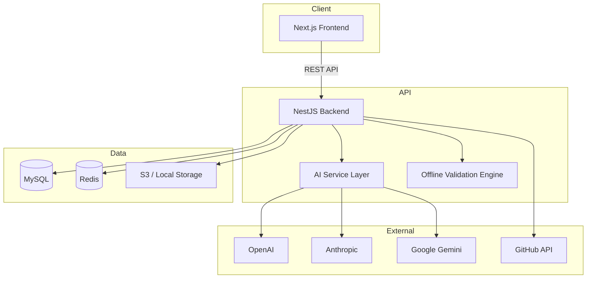

# Architecture Documentation

## System Overview



## Clean Architecture Layers

### 1. Presentation Layer (Frontend)
- **Pages**: App Router pages for each feature area
- **Components**: Reusable UI (ShadCN-style), editor, layout
- **Stores**: Zustand state management (editor, auth, settings, UI)
- **API Client**: Centralized HTTP client with JWT handling

### 2. Application Layer (Backend Controllers)
- REST controllers with Swagger documentation
- DTO validation via class-validator
- JWT guards for protected routes

### 3. Domain Layer (Backend Services)
- Business logic in injectable services
- AI provider abstraction via strategy pattern
- Offline validation engine (works without AI)
- Format detection and conversion logic

### 4. Infrastructure Layer
- TypeORM entities and MySQL persistence
- Redis caching layer
- S3/local file storage
- External API integrations (GitHub, AI providers)

## AI Provider Abstraction

```typescript
interface AIProviderInterface {
  readonly name: AIProvider;
  isConfigured(): boolean;
  complete(request: AICompletionRequest): Promise<AICompletionResponse>;
}
```

Implementations: `OpenAIProvider`, `AnthropicProvider`, `GeminiProvider`, `DeepSeekProvider`, `AzureOpenAIProvider`

The `AiService` selects the configured provider and tracks API usage in MySQL.

## Validation Pipeline

1. **Format Detection** — extension + content heuristics
2. **Offline Validation** — syntax, structure, secrets, K8s rules
3. **AI Validation** (optional) — deep analysis when API key configured
4. **Result Merge** — deduplicated issues with severity scoring

## Real-Time Collaboration (Architecture Ready)

The database schema includes `team_members` and `comments` tables. WebSocket integration can be added via NestJS `@WebSocketGateway` for:
- Shared editing sessions
- Line-level comments
- Review/approval workflows

## Plugin System (Future)

The offline validation engine is designed for extension:

```typescript
// Future plugin interface
interface ValidationPlugin {
  name: string;
  formats: FileFormat[];
  validate(content: string): ValidationIssue[];
}
```

## Multi-Cloud Cost Estimation

Current implementation uses resource-type heuristics. Production deployment should integrate:
- AWS Pricing API
- Azure Retail Prices API
- GCP Cloud Billing Catalog API

## Deployment Topology

### Docker Compose (Development)
4 services: mysql, redis, backend, frontend

### Kubernetes (Production)
- 2 replicas each for backend and frontend
- PersistentVolumeClaim for MySQL
- Ingress with path-based routing (`/api` → backend, `/` → frontend)
- ConfigMap + Secret for environment configuration
