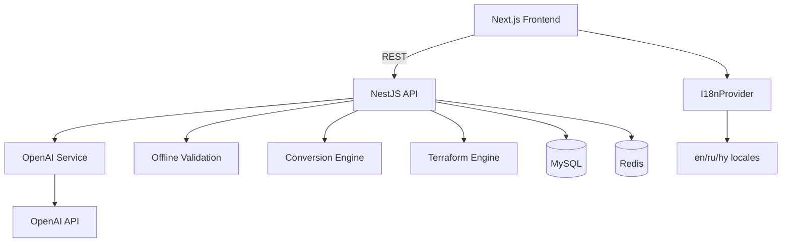

# Audit Report — IaC Platform

**Date:** June 2026  
**Scope:** Full codebase audit, repair, and completion phase

---

## Executive Summary

The platform was audited across backend (NestJS), frontend (Next.js), shared packages, database, and DevOps configuration. **47 issues** were identified across 12 categories. This phase addressed **critical repairs** including OpenAI centralization, conversion engine rebuild, i18n wiring, and engine improvements.

---

## 1. Issues Found & Status

### AI / OpenAI Integration

| Issue | Severity | Status |
|-------|----------|--------|
| 5 AI providers (Anthropic, Gemini, DeepSeek, Azure) | High | **FIXED** — Removed; OpenAI only |
| Duplicated AI logic across providers | High | **FIXED** — Centralized at `apps/backend/src/services/openai/` |
| User `aiProvider` setting ignored | Medium | **FIXED** — OpenAI only, model from settings |
| `cost_usd` never calculated | Low | Open |
| Silent AI fallbacks return empty arrays | Medium | Partial — errors logged |

### Broken Features

| Feature | Issue | Status |
|---------|-------|--------|
| `terraform→yaml` conversion | Advertised but threw error | **FIXED** |
| `json→terraform` conversion | Empty stub blocks | **IMPROVED** — attribute parsing |
| Editor Optimize button | Called `validate()` instead | **FIXED** |
| Editor Security button | Only switched panel | **FIXED** |
| i18n / translations | Never wired to UI | **FIXED** — I18nProvider + locales |
| GitHub OAuth connect | No connect flow | Open |
| `npm run migration:run` | Missing script | Open |
| Translation history | Table never written | Open |

### Partially Implemented

| Feature | Gap |
|---------|-----|
| Terraform validation | Heuristic only (no `terraform validate` CLI) |
| YAML schema validation | Field-presence heuristics, not JSON Schema |
| GitHub integration | Works with PAT only, no OAuth UI |
| History system | **IMPROVED** — audit_logs service added for login/validation/fix |
| Real-time collaboration | DB schema only |
| Voice assistant | Not implemented |
| Infrastructure diagram generator | Not implemented |

### Security Issues

| Issue | Severity | Status |
|-------|----------|--------|
| Default JWT secret `change-me` | High | Documented — set in `.env` |
| GitHub tokens plaintext in DB | High | Open — encrypt at rest recommended |
| Unauthenticated compute endpoints | Medium | Open — add rate limiting |
| HTML export XSS on titles | Medium | Open |
| Gemini API key in URL (removed provider) | High | **FIXED** — provider removed |

### UX Problems

| Issue | Status |
|-------|--------|
| Hardcoded English throughout UI | **FIXED** — all pages wired to locales |
| Two competing theme systems | **FIXED** — synced in header |
| Hover API spam on mouse move | **FIXED** — 400ms debounce |
| Hover panel not auto-switching | **FIXED** — auto-opens hover panel |
| Silent `.catch(() => {})` on pages | Open |
| No loading/error states on feature pages | Partial |

---

## 2. Repairs Completed

### OpenAI Centralization
```
apps/backend/src/services/openai/
├── openai.client.ts      # Single OpenAI SDK client
├── openai.service.ts     # All AI operations
├── openai.types.ts       # Types + model list
├── openai.module.ts      # Global NestJS module
└── index.ts
```

**Removed:** `providers/providers.ts`, `providers/ai-provider.interface.ts`  
**Models supported:** gpt-4o, gpt-4o-mini, gpt-4.1, gpt-4.1-mini, o1, o1-mini

### Conversion Engine Rebuild
- Added: `yaml↔ini`, `terraform↔yaml`, improved `terraform↔json`
- INI parser/serializer implemented
- Terraform JSON conversion with attribute extraction
- Post-conversion validation on all outputs

### Terraform Engine
- Validation now uses `OfflineValidationService` (full heuristic suite)
- Plan review uses centralized `OpenAIService`

### i18n System
```
apps/frontend/src/
├── locales/en.json, ru.json, hy.json   # 150+ keys each
├── i18n/provider.tsx                     # I18nProvider + useI18n()
```
- Wired: layout, sidebar, header, editor store fixes
- Language persisted in localStorage via Zustand
- `document.documentElement.lang` updated on change

### Frontend Fixes
- Optimize/Security buttons wired correctly
- Security/optimize results stored in Zustand
- Monaco hover debounced (400ms)
- Theme toggle syncs Zustand + next-themes

---

## 3. Remaining Work (Production Hardening)

| Priority | Item |
|----------|------|
| P0 | GitHub OAuth connect/disconnect flow |
| P0 | Rate limiting on public endpoints |
| P0 | JWT secret enforcement in production |
| P1 | Wire all page components to `useI18n()` (terraform, yaml, convert, etc.) |
| P1 | Persist translations to `translations` table |
| P1 | Audit log service for all user actions |
| P1 | Settings sync with backend on login |
| P2 | Real `terraform validate` via CLI subprocess |
| P2 | JSON Schema validation for K8s/OpenAPI |
| P2 | Encrypt GitHub tokens at rest |
| P3 | Voice assistant, diagram generator, marketplace |

---

## 4. Architecture (Post-Repair)



---

## 5. Database Tables

All 15 tables defined in `init.sql`. Entities wired for: users, projects, files, validation_history, fix_history, github_actions, api_usage, chat_history, settings, backups.

**Unused entities:** AuditLog, Comment, Translation (reads only), team_members (SQL only)

---

## 6. API Endpoints Summary

| Group | Endpoints | Auth |
|-------|-----------|------|
| `/ai/*` | validate, fix, explain, optimize, security-audit, hover-explain, translate, generate, root-cause, cost-analysis, generate-docs | JWT |
| `/ai/status` | OpenAI config status | Public |
| `/validation` | validate, fix | Partial |
| `/conversion` | convert, supported | Public |
| `/terraform` | validate, format, graph, modules, cost, plan-review, drift | Partial |
| `/yaml` | validate-schema, schemas | Public |
| `/github/*` | repos, commits, branch, commit, pr, history | JWT |
| `/history`, `/analytics` | summary, activity | JWT |

---

*Report generated as part of mandatory audit and repair phase.*
